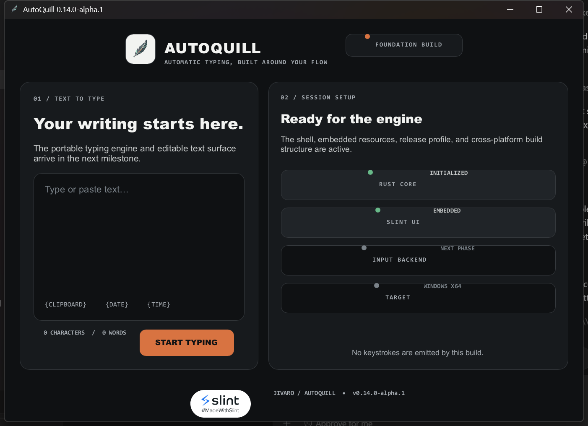

# AutoQuill

AutoQuill is being ported from Python/PySide6 to a compact Rust + Slint desktop application.
The current source includes a branded, interactive editor and a safe simulation preview backed by
the portable runtime-variable compiler and deterministic session engine. Start, Pause/Resume,
Stop, Reset, startup delay, active-time limits, loops, breaks, short pauses, and visible simulated
corrections are functional. Simulation never emits external keystrokes.



The product roadmap is in [BUILD_PLAN.md](BUILD_PLAN.md), with the work-package sequence in
[docs/EXECUTION_PLAN.md](docs/EXECUTION_PLAN.md).

## Windows preview

The currently published Phase 0 Windows x64 executable is available at
[`dist/AutoQuill-windows-x64.exe`](dist/AutoQuill-windows-x64.exe). This Phase 0 preview displays
the application shell. Per the release plan, `dist` is refreshed only after the complete Phase 1
gate. The newest verified local development build is preserved at
`local-builds/AutoQuill-windows-x64.exe` (gitignored); build current source to recreate it on a new
machine.

## Current safety boundary

The current build does **not** listen for global shortcuts or emit keystrokes. Those behaviors will
be introduced behind tested platform interfaces in later phases.

## Prerequisites

- Rust 1.97.1 (managed automatically through `rust-toolchain.toml` when using rustup)
- Native build prerequisites required by Slint for the target operating system

## Development

```text
cargo fmt --check
cargo clippy --all-targets -- -D warnings
cargo test
cargo run
```

Development and test profiles disable debug-symbol and incremental caches to keep storage usage
manageable. After preserving a verified release executable, remove Cargo artifacts with:

```text
powershell -ExecutionPolicy Bypass -File scripts/clean-local.ps1
```

## Release builds

The software renderer is the default. It produced much faster startup on the Phase 0 Windows
baseline while keeping the raw executable close to the FemtoVG build in size:

```text
cargo build --profile release-size --locked
```

For the FemtoVG comparison build:

```text
cargo build --profile release-size --locked --no-default-features --features renderer-femtovg
```

The packaged raw executable embeds the Slint markup and image resources. Platform-specific bundles
and installers will be added during the packaging phase.

See [docs/DEPENDENCY_SAFETY.md](docs/DEPENDENCY_SAFETY.md) for the locked dependency safeguard
added after an unexpected build-script download attempt was observed during a clean rebuild.

## Licensing notice

The application displays Slint's `AboutSlint` attribution widget under the Slint Royalty-Free
Desktop, Mobile, and Web Applications License. See [THIRD_PARTY_NOTICES.md](THIRD_PARTY_NOTICES.md).
